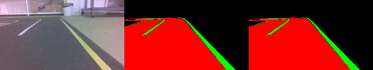
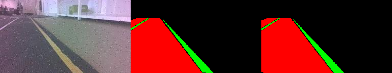

# Driveable Area Segmentation with U-Net

Implementation of a U-Net based deep learning model for multiclass segmentation in autonomous driving scenarios, detecting background, driveable areas, and lane markings. Combines advanced techniques for handling class imbalance and data augmentation.

## Features

- Custom U-Net with dropout and batch normalization
- Albumentations for data augmentation
- Combined Focal Loss (with class weights) + Dice Loss for multiclass segmentation
- Mixed-precision training support
- Comprehensive metrics (Mean IoU, Loss)
- Model checkpointing and prediction visualization

## Project Structure

```plaintext
.
├── dataset/
│   ├── train/         		  # Training images (RGB)
│   ├── train_masks/   		  # Training masks (Multiclass: 0-background, 1-driveable, 2-lanes)
│   ├── val/           		  # Validation images
│   └── val_masks/     		  # Validation masks
├── model.py                  # U-Net implementation
├── dataset.py                # Dataset & transforms
├── train.py                  # Training script
├── saved_images/             # Prediction samples
├── checkpoints/              # Trained model weights
├── model/                    # model
└── README.md
```

## Requirements

- Python 3.8+
- PyTorch 1.12+
- Torchvision 0.13+
- Albumentations 1.3+
- Torchmetrics 0.11+
- NumPy, Pillow, OpenCV
- CUDA 11.6+ (recommended)
- NVIDIA GPU (recommended)
- Netron (optional, for model visualization)
- Doxygen (for documentation generation)

```sh
pip install torch torchvision albumentations torchmetrics tqdm numpy pillow opencv-python
```

## Dataset Preparation

- Download a multiclass lane detection dataset (e.g., from Kaggle or a similar source compatible with 3-class segmentation: background, driveable area, lanes).
- Organize files as follows:

```plaintext
dataset/
├── train/
│   ├── 0001.jpg
│   ├── 0002.jpg
│   └── ...
├── train_masks/
│   ├── 0001_mask.png
│   ├── 0002_mask.png
│   └── ...
├── val/
│   ├── 0001.jpg
│   ├── 0002.jpg
│   └── ...
├── val_masks/
│   ├── 0001_mask.png
│   ├── 0002_mask.png
│   └── ...
```

- Masks should be PNG files with pixel values 0 (background), 1 (driveable area), and 2 (lanes).

## Training

Configure hyperparameters in `train.py`:

```sh
# Hyperparameters
LEARNING_RATE = 0.001
BATCH_SIZE = 8
NUM_EPOCHS = 1
IMAGE_HEIGHT = 144
IMAGE_WIDTH = 256
```

Start training:

```sh
python train.py
```

Training and validation metrics (Loss and mIoU) are logged to training_log.log in the project root directory. The log file records metrics for each epoch, including training loss, training mIoU, validation loss, and validation mIoU, with timestamps for tracking progress.

Example log entry:

```sh
# Example
Epoch 1 - Train Loss:  0.1830, Train mIoU: 0.7943
Epoch 1 - Val Loss: 0.0978, Val mIoU: 0.8540
Modelo salvo (melhor mIoU: 0.8540)
```

## Evaluation

Metrics are calculated during training, as well as saved to training_log.log:(example) 

```sh
# Example
Epoch 1 - Train Loss:  0.1830, Train mIoU: 0.7943
Epoch 1 - Val Loss: 0.0978, Val mIoU: 0.8540
```

The model uses Mean Intersection over Union (mIoU) as the primary metric for multiclass segmentation performance.

## Model Architecture

```python
class UNET(nn.Module):
    def __init__(self, in_channels=3, out_channels=3, features=[32, 64, 128, 256]):
        # Custom U-Net with:
        - DoubleConv blocks with dropout
        - Learnable upsampling (ConvTranspose2d)
        - Kaiming weight initialization
        - Skip connections for feature preservation
```

The U-Net model is designed for multiclass segmentation with 3 output channels (background, driveable area, lanes). It uses a series of DoubleConv blocks with batch normalization, ReLU activation, and dropout, followed by max-pooling for the encoder and transposed convolutions for the decoder.

## Model Visualization

[](/MLDrivableAreaDetection/assets/model_drivable.onnx.png)

The U-Net model architecture can be visualized using Netron. Export the model to ONNX format (`model_graph.onnx`) and load it into Netron to inspect the network's layers, skip connections, and parameters.

To visualize:

- Install Netron: `pip install netron` or use the web version at [netron.app](https://netron.app).
- Export the model to ONNX (requires additional code in `train.py` or a separate script).
- Run `netron model_graph.onnx` or upload `model_graph.onnx` to the Netron web interface.

## Documentation

[](https://nunotaboada.github.io/MLDrivableAreaDetection/)

Comprehensive documentation for the project is generated using Sphinx, covering all modules, including model.py, dataset.py, and train.py. The documentation is available as HTML and includes an index that links to all modules and reports.
Requirements
The following packages are required for testing and documentation:

- pytest
- pytest-cov
- pytest-html
- sphinx
- sphinx-rtd-theme

Install them using:

```sh
pip install pytest pytest-cov pytest-html sphinx sphinx-rtd-theme
```
Running Tests and Generating Coverage Reports in terminal:

```sh
# To run tests and generate coverage reports using pytest:
pytest tests/ --cov=dataset --cov=train --cov=model --cov-report=term --html=report.html -v --tb=long
```
Tests are located in the `tests/` directory.
The coverage report will be generated in terminal

The test report will be saved as `report.html`.

## Loss Functions

The model uses a combined loss function to address class imbalance and optimize segmentation:

```python
loss = 0.7 * FocalLoss_w() + 1.3 * DiceLoss()

class FocalLoss_w(nn.Module):
    def __init__(self, gamma=2.0, alpha=torch.tensor([0.2118, 0.2732, 2.5150]), reduction='mean'):
        # Handles class imbalance with per-class weights

class DiceLoss(nn.Module):
    def forward(self, inputs, targets):
        # Optimizes for segmentation overlap across multiple classes
```

- **FocalLoss_w**: Uses class weights to focus on hard-to-classify examples and balance the importance of background (0), driveable area (1), and lanes (2).
- **DiceLoss**: Maximizes the overlap between predicted and ground truth segmentation maps.

## Performance

Example performance metrics (dependent on dataset and training):

```plaintext
| Metric     | Validation |
|------------|:----------:|
| mIoU       | 0.9858     |
| Loss       | 0.01       |
```

*Metrics will vary based on the dataset and training configuration.*

## Results

  
*Input | Ground Truth Mask | Predicted Mask*


  
*Input | Ground Truth Mask | Predicted Mask*

The visualization shows the input image, ground truth mask (colored: black=background, red=driveable, green=lanes), and predicted mask side by side.

---

Developed by: Team07 - SEA:ME Portugal

[]()
